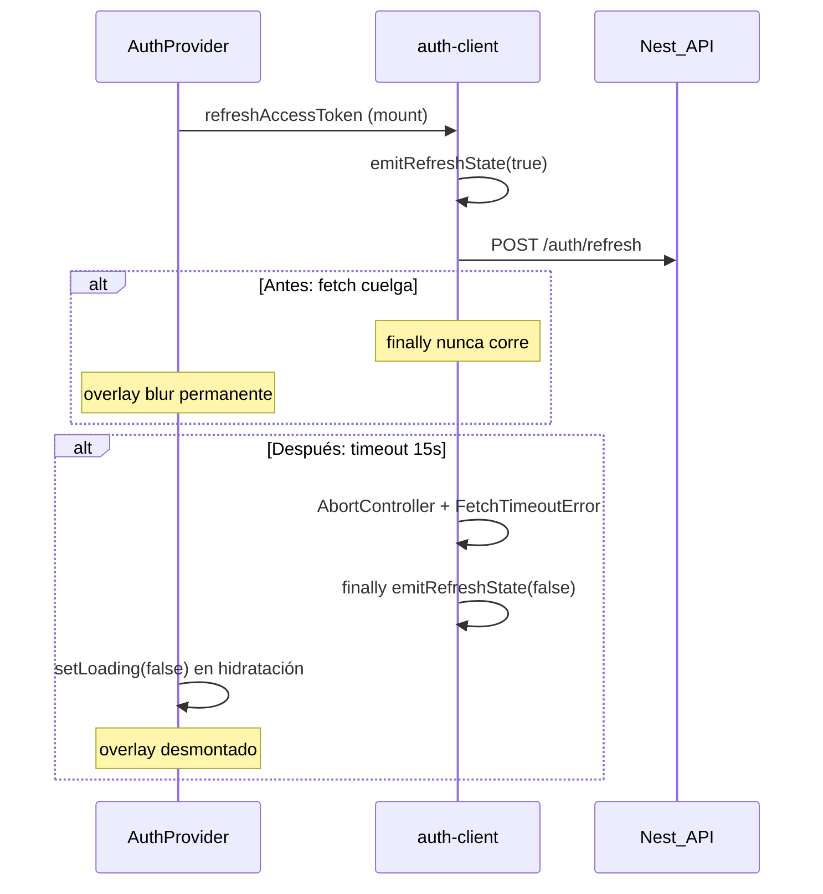

# Estabilización de plataforma frontend — auth y overlay

## Resumen

Corrección del bloqueo global en producción (`app.heydoctor.health`): blur/frost persistente, login colgado y UI aparentemente congelada. La causa no es CSS cosmético sino **ciclos de vida async de auth sin límite ni cancelación**.

## Causa raíz

`AuthProvider` monta un overlay de revalidación (`backdropFilter: blur(2px)`) cuando `sessionRevalidating === true`. Ese estado lo controla `emitRefreshState` en `lib/auth-client.ts` durante `POST /auth/refresh`.

Antes de esta estabilización:

1. `fetch` de refresh **no tenía timeout ni `AbortController`**.
2. Si la petición colgaba, el `finally` de `_doRefresh` **nunca ejecutaba** → `emitRefreshState(false)` no corría.
3. El overlay permanecía montado en toda la app.
4. La hidratación inicial (`refreshAccessToken` + `getMe`) también podía colgar → `loading === true` indefinido → `PanelLayout` mostraba pantalla negra en rutas `/panel/*`.
5. Login podía colgar en `bootstrapApiCsrf()` o `POST /auth/login` sin límite.

## Ciclo de vida (fallo vs recuperación)



## Estrategia de estabilización

| Capa | Responsabilidad |
|------|-----------------|
| `lib/async/fetch-with-timeout.ts` | Timeout + abort composable para fetches auth |
| `lib/async/with-timeout.ts` | Acotar promesas (hidratación refresh/getMe) |
| `lib/async/auth-request-config.ts` | Timeouts centralizados (local = Vercel) |
| `lib/auth-client.ts` | Refresh/CSRF/login acotados; `forceResetRefreshState`, `cancelInFlightAuthRequests` |
| `lib/context/AuthContext.tsx` | Hidratación con timeout; watchdog overlay; cleanup unmount |
| `lib/runtime-stabilizer.ts` | Recovery de overlay/hidratación atascados; limpieza html/body auth-only |
| `lib/hooks/useAuthRuntimeStabilizer.ts` | Watchdog periódico conectado al provider |
| `lib/auth-telemetry.ts` | Eventos PHI-safe para observabilidad |

## Garantías de recovery

| Escenario | Comportamiento |
|-----------|----------------|
| Refresh > `AUTH_REQUEST_TIMEOUT_MS` (15s default) | Abort, `sessionRevalidating=false`, overlay off |
| CSRF bootstrap timeout | Telemetría `csrf_bootstrap_timeout`; login no cuelga indefinidamente |
| Hidratación > `AUTH_HYDRATION_MAX_MS` (25s) | `loading=false`, telemetría `hydration_recovery` |
| Overlay > `AUTH_OVERLAY_MAX_MS` (20s) | `forceResetRefreshState` + `overlay_recovery` |
| Unmount durante auth | `cancelInFlightAuthRequests()` |
| 401 retry en `heydoctor-api` tras timeout refresh | **Sin** segundo refresh inmediato (`consumeLastRefreshTimedOut`) |

## Configuración

Variable opcional (misma en local y producción):

```env
NEXT_PUBLIC_AUTH_REQUEST_TIMEOUT_MS=15000
```

Derivados automáticos:

- `AUTH_OVERLAY_MAX_MS` = max(timeout + 5s, 20s)
- `AUTH_HYDRATION_MAX_MS` = max(timeout + 10s, 25s)

## Telemetría (PHI-safe)

Hook opcional: `window.__HEYDOCTOR_AUTH_TELEMETRY__(event, detail)`.

Eventos nuevos:

- `refresh_timeout`, `csrf_bootstrap_timeout`, `bootstrap_timeout`
- `overlay_recovery`, `stale_loading_reset`, `hydration_recovery`

`detail` solo incluye `status`, `durationMs`, `phase`, `reason` — sin tokens, emails ni PHI.

## Validación local

```bash
npm ci
npm run lint
npm test
npm run build
npm run dev
```

Smoke manual:

1. `/login` — throttling/offline en DevTools: el blur desaparece y el botón sale de “Ingresando…”.
2. Bloquear `POST .../auth/refresh` — overlay como máximo ~20s, luego UI usable.
3. `/panel` — no pantalla negra permanente tras hidratación.

## Archivos principales

- `lib/auth-client.ts`
- `lib/context/AuthContext.tsx`
- `lib/runtime-stabilizer.ts`
- `lib/async/fetch-with-timeout.ts`
- `lib/heydoctor-api.ts`

## Lo que no se modificó

- Overlays legítimos: WebRTC, consentimientos, cookie banner.
- Suspense/hydration global de Next.js.
- Endpoints auth del backend Nest/Railway.

---

## Post-merge gaps (PR #32 → hotfix definitivo)

El merge #32 (`b6c40b7`) desplegó timeouts y stabilizer, pero **el blur persistió en producción** porque:

| Gap | Síntoma | Hotfix |
|-----|---------|--------|
| Overlay acoplado a **todo** refresh | Blur en `/` y `/login` al cargar | `refreshAccessToken({ silent: true })` para background |
| Refresh en rutas públicas sin sesión | `POST /auth/refresh` innecesario cross-origin | `shouldSkipAuthBootstrapOnMount()` |
| `withTimeout` sin cancelar refresh | Overlay hasta 15s tras abandonar bootstrap | `recoverFromBootstrapFailure()` |
| Login → getMe → retry 401 → refresh | "Ingresando…" + blur durante login | `getMe({ skipRefreshRetry: true })` + `login-transaction` timeout |
| CI `typecheck` ausente en main | GitHub rojo, Vercel despliega igual | Script `typecheck` en `package.json` |

## Matriz Git / Vercel / CI

| Entorno | Commit esperado tras hotfix | CI |
|---------|----------------------------|-----|
| Preview (`fix/frontend-platform-stabilization`) | Último push de la rama | Verde |
| Production (`main`) | Mismo commit tras merge post-preview | Verde |

## Checklist smoke pre-merge (preview Vercel)

1. `/` — sin blur a los 3s (visitante anónimo).
2. `/login` — sin blur; formulario usable; **sin** `POST /auth/refresh` en Network.
3. Login — completa o error claro en ≤ 25s; botón sale de "Ingresando…".
4. `/panel` — hidratación normal con sesión existente.
5. `window.__HEYDOCTOR_AUTH_TELEMETRY__` — sin `overlay_recovery` en carga anónima normal.
