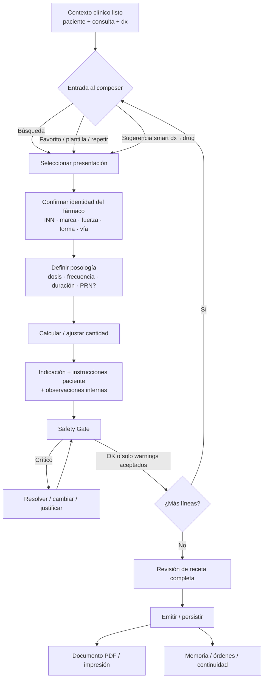
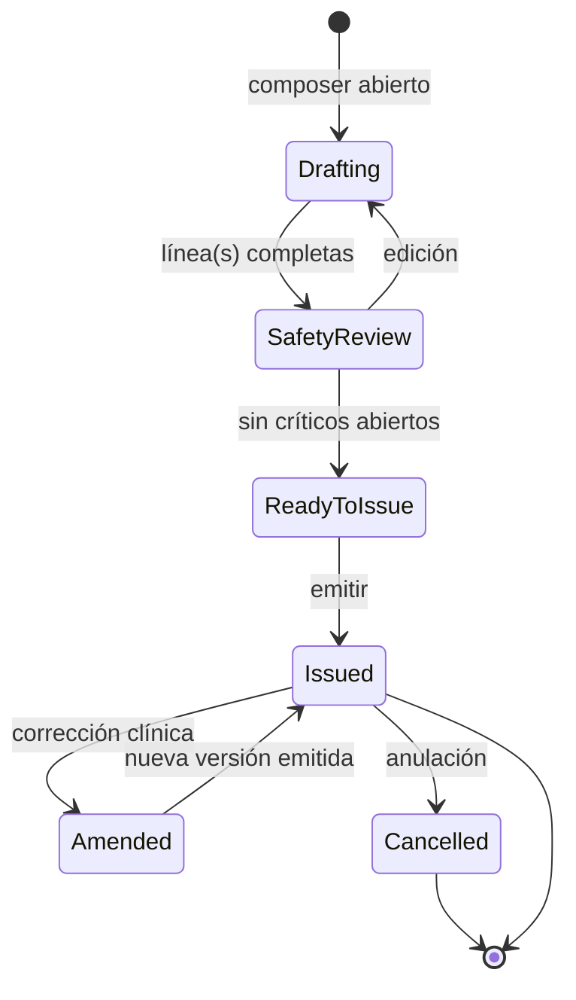
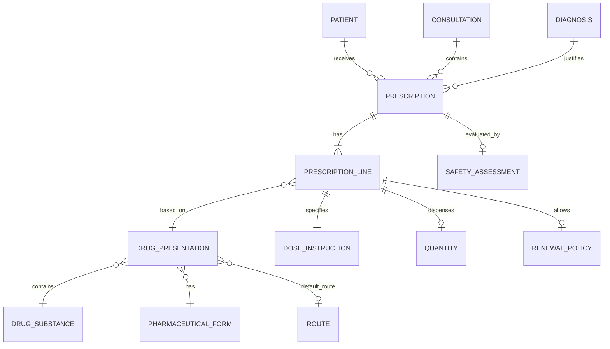
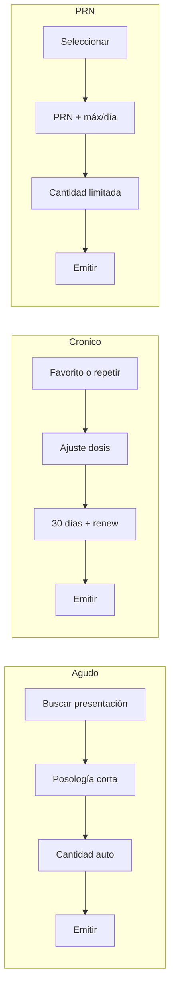
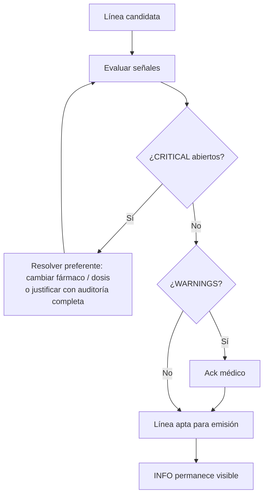
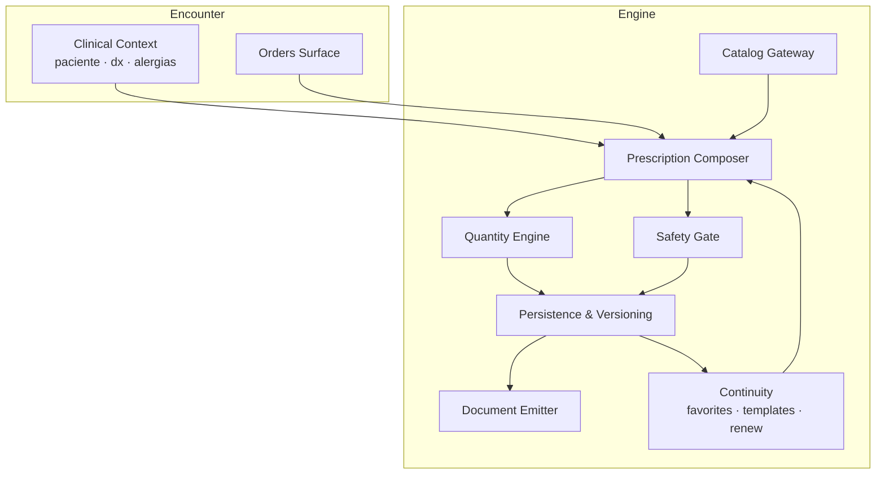

# Prescription Engine Enterprise — Phase 0  
## Clinical Design & Domain Modeling

**ID:** `PRESCRIPTION-ENGINE-ENTERPRISE-PHASE-0`  
**Tipo:** Diseño de dominio clínico (sin implementación)  
**Fecha:** 2026-07-22  
**Precedente:** Phase 1 Audit (`PRESCRIPTION-ENGINE-ENTERPRISE-AUDIT.md`) — **aprobada**  
**Rama:** `feature/prescription-engine-enterprise`  
**STATUS:** APPROVED by Product Owner (2026-07-22)  
**Siguiente autorizado:** PR-1 Catalog-aware FE client  

**Reglas de este documento**
- Diseña el **dominio clínico**, no tablas ni componentes React.
- Representa el flujo real del médico en consulta.
- Decisiones de Product Owner de §0bis y §7.3 son vinculantes para implementación.

---

## 0bis. Prescription Engine Principles

Principios permanentes del motor (aprobados por Product Owner):

1. **Physician remains in control.** El médico decide siempre qué se prescribe y qué se emite.
2. **AI assists but never prescribes.** La IA / Copilot puede sugerir; nunca escribe la receta por sí sola.
3. **Every suggestion is rejectable.** Toda sugerencia (catálogo, smart, favorito, IA) puede descartarse sin fricción.
4. **Every prescription is fully reproducible.** Identidad del fármaco, posología, cantidad, safety ack/justificación y autoría quedan reconstruibles.
5. **Clinical judgment always prevails.** Ninguna regla automática sustituye el criterio clínico.
6. **Country-independent architecture.** Catálogo y jurisdicción son parámetros; el motor no asume un solo país.
7. **Full auditability.** Toda emisión, warning ack y justificación CRITICAL quedan auditados.

---

## 0. Principios de diseño clínico

1. **Presentation-first:** el médico elige una presentación dispensable (producto + concentración + forma + vía usual), no un string libre.
2. **Una línea = una intención terapéutica** clara (qué, cuánto, cómo, por cuánto tiempo, para qué).
3. **Velocidad sin ocultar seguridad:** defaults inteligentes; safety visible sin bloquear el ritmo de forma opaca.
4. **Separación de capas:** catálogo ≠ línea prescrita ≠ documento emitido ≠ memoria longitudinal.
5. **Backward compatible:** el MVP actual sigue siendo legible; el motor nuevo es evolución, no ruptura histórica.
6. **HITL:** advertencias requieren atención humana; CRITICAL exige justificación auditada (no bloqueo ciego).

---

## 1. Flujo completo de prescripción

### 1.1 Diagrama de extremo a extremo

### 1.2 Etapas clínicas (definición)

| # | Etapa | Actor | Resultado |
|---|--------|-------|-----------|
| 1 | **Contexto** | Sistema + médico | Paciente, consulta, alergias visibles, diagnóstico activo |
| 2 | **Selección** | Médico | Presentación elegida (catálogo) o intención “repetir/plantilla” |
| 3 | **Identidad** | Sistema confirma / médico valida | INN, concentración, forma, vía, jurisdicción |
| 4 | **Posología** | Médico (+ defaults) | Dosis, frecuencia, duración, patrón (agudo/crónico/PRN/titulación) |
| 5 | **Cantidad** | Sistema propone / médico ajusta | Unidades a dispensar / días de tratamiento |
| 6 | **Comunicación** | Médico | Indicación, instrucciones al paciente, observaciones |
| 7 | **Safety** | Sistema + médico | Severidades resueltas o aceptadas |
| 8 | **Composición** | Médico | Receta multi-línea completa |
| 9 | **Emisión** | Médico | Persistencia + documento verificable |
| 10 | **Continuidad** | Sistema | Favoritos/uso, memoria, renovaciones futuras |

### 1.3 Estados de la receta (dominio)

- **Drafting:** trabajo en curso; no es documento legal.
- **ReadyToIssue:** safety críticos resueltos.
- **Issued:** versión emitida (PDF/hash/código).
- **Amended:** supersede por versión nueva (no editar silencio histórico).
- **Cancelled:** soft-cancel clínico.

---

## 2. Modelo clínico (entidades conceptuales)

### 2.1 Mapa de dominio

### 2.2 Catálogo (conocimiento farmacéutico)

| Entidad | Definición clínica | Atributos mínimos |
|---------|-------------------|-------------------|
| **Medicamento (sustancia / INN)** | Principio activo terapéutico | nombre INN, grupo terapéutico, ATC |
| **Presentación** | Forma dispensable concreta | sustancia(s), concentración/fuerza, forma farmacéutica, vía usual, jurisdicción, label clínico |
| **Concentración** | Magnitud de principio activo por unidad | valor + unidad (ej. 500 mg, 5 mg/ml) |
| **Forma farmacéutica** | Presentación física | comprimido, cápsula, suspensión, inhalador, etc. |
| **Vía** | Vía de administración | oral, IV, IM, SC, tópica, inhalatoria, etc. |

### 2.3 Acto de prescripción

| Entidad | Definición clínica | Atributos mínimos |
|---------|-------------------|-------------------|
| **Receta (Prescription)** | Documento clínico emitido en un encuentro | paciente, consulta, diagnóstico asociado, líneas, notas globales, estado, versión |
| **Línea de prescripción** | Una orden farmacológica | presentación (o snapshot), dosis, frecuencia, duración, cantidad, indicación, instrucciones, observaciones, renovaciones, sustitución |
| **Dosis** | Cantidad por toma | valor, unidad, forma de expresión (1 comprimido / 5 ml / 10 mg) |
| **Frecuencia** | Ritmo de administración | patrón (TID, c/8h, 1-0-1), o PRN con máximo/día |
| **Duración** | Horizonte temporal | N días / hasta nueva orden / crónico |
| **Cantidad** | Lo que se dispensa | unidades totales o días de suministro |
| **Indicaciones** | Para qué se prescribe (por línea o receta) | texto clínico ligado al dx |
| **Observaciones** | Notas para el equipo / farmacia (no siempre al paciente) | texto interno |
| **Instrucciones al paciente** | Cómo tomar (lenguaje paciente) | texto orientado a adherencia |
| **Renovaciones** | Política de repetición | N renovaciones / intervalo / hasta fecha |
| **Sustitución permitida** | ¿puede dispensarse genérico/equivalente? | sí / no / solo misma sustancia |
| **Diagnóstico asociado** | Justificación clínica | CIE-10 + label |

### 2.4 Snapshot vs catálogo vivo

Al **emitir**, cada línea congela un **MedicationSnapshot**:

- INN / marca / concentración / forma / vía
- `presentationId` de origen (si existía)
- Posología y cantidad finales
- Flags: PRN, titulación, pediátrico, sustitución

Así, cambios futuros del vademécum **no alteran** recetas históricas.

### 2.5 Cardinalidad clínica

- 1 Receta → 1..N líneas  
- 1 Línea → 1 presentación (snapshot)  
- 1 Receta → 0..1 diagnóstico principal (CIE-10); líneas pueden heredar o precisarse  
- 1 Paciente → muchas recetas a lo largo del tiempo (memoria ≠ documento)

---

## 3. Workflow médico

### 3.1 Cómo prescribe realmente un médico

1. Tiene en mente **problema + fármaco** (a menudo desde dx).
2. Elige **presentación conocida** (marca/genérico + mg + forma).
3. Define **cuánto y cada cuánto** (hábitos: “1-0-1 × 7 días”).
4. Decide **cuántas cajas/días** (o deja default).
5. Añade **frase al paciente** si hace falta (“con alimentos”, “si dolor”).
6. Revisa alergias mentalmente / en ficha.
7. Emite e imprime / envía PDF.
8. En crónicos: **repite** o ajusta la última pauta.

El motor debe acortar 2–5 y hacer 6 **explícito e ineludible** sin fricción.

### 3.2 Patrones de tratamiento

#### A) Medicación aguda
- Duración finita (3–14 días típico).
- Cantidad ≈ dosis × tomas/día × días.
- Ejemplo: amoxicilina 500 mg c/8h × 7 días.

#### B) Tratamientos crónicos
- Duración “continuo” / hasta nueva orden.
- Cantidad por ciclo de dispensación (30 días).
- Renovaciones frecuentes.
- Ejemplo: losartán 50 mg 1-0-0 continuo.

#### C) Tratamientos PRN (si necesita)
- Frecuencia = “según necesidad” + **máximo en 24 h** + criterio (“si dolor >5/10”).
- Cantidad acotada (evitar stock ilimitado).
- Ejemplo: ibuprofeno 400 mg PRN, máx 3/día × 5 días.

#### D) Tratamientos pediátricos
- Dosis por **peso/edad** (mg/kg) cuando aplique.
- Forma preferente: suspensión / gotas.
- Cantidad en ml o frasco.
- Safety: límites por edad/peso (diseño; CDSS futuro).

#### E) Medicación titulada
- Pauta escalonada en el tiempo (semana 1 / semana 2).
- Puede ser **una línea con instrucciones de titulación** o **varias líneas temporales**.
- Dominio v1: soportar texto estructurado de titulación + flag `titration=true`.
- Dominio v2: pasos temporales formales.

#### F) Renovaciones
- Desde receta previa Issued: “Renovar” copia líneas editables.
- Política: N renovaciones restantes / fecha límite.
- Safety: re-evaluar alergias y duplicidad al renovar.

### 3.3 Workflows por escenario

---

## 4. Safety Model (diseño — sin implementar CDSS)

### 4.1 Principio
Safety es un **gate de decisión clínica**, no un bloqueo técnico opaco.

### 4.2 Severidades

| Severidad | Significado | Comportamiento UX (PO) |
|-----------|-------------|------------------------|
| **CRITICAL** | Riesgo alto de daño si se emite | **No bloquea automáticamente.** Emisión permitida **solo** con justificación obligatoria + auditoría completa (usuario, fecha, motivo, persistencia) |
| **WARNING** | Riesgo o interacción relevante | Emisión permitida tras **ack** visible |
| **INFO** | Contexto útil | Visible, no requiere ack |

#### 4.2.1 Política CRITICAL (aprobada)

- El sistema **nunca** impide la emisión por un CRITICAL de forma automática.
- Para emitir con CRITICAL abierto el médico **debe** registrar:
  - justificación (motivo clínico obligatorio),
  - usuario (identidad),
  - fecha/hora,
  - motivo tipificado o texto libre estructurado,
  - persistencia auditable ligada a la versión emitida.
- Sin ese paquete de justificación, la emisión no avanza (gate de calidad/auditoría, no “bloqueo clínico opaco”).
- Resolver cambiando fármaco/dosis sigue siendo el camino preferido; la justificación es el escape controlado.

### 4.3 Familias de señales (diseño)

| Familia | Ejemplos | Severidad típica |
|---------|----------|------------------|
| Alergia / hipersensibilidad | Match sustancia/ATC vs perfil | CRITICAL / WARNING |
| Duplicidad terapéutica | Mismo ATC o misma sustancia activa en memoria/órdenes | WARNING (CRITICAL si mismo fármaco activo) |
| Contraindicación | Embarazo, lactancia, edad (cuando existan reglas activas) | CRITICAL / WARNING |
| Dosis fuera de rango | Pediátrico / adulto extremos | WARNING → CRITICAL si extremo |
| Interacción farmacológica | Fármaco–fármaco (fase posterior) | WARNING |
| Datos incompletos | Sin duración en agudo, PRN sin máx/día | WARNING / bloqueo suave de calidad |

### 4.4 Flujo Safety Gate

> **PO:** CRITICAL no es hard-block automático; es gate de justificación auditada.

### 4.5 Separación de responsabilidades

| Capa | Responsabilidad |
|------|-----------------|
| Catálogo | Identidad del producto |
| Composer | Completitud de la orden |
| Safety Gate | Riesgo clínico |
| Emisión | Persistencia + documento |
| Auditoría | Quién aceptó qué warning / justificación |

**No se implementa CDSS en esta fase.** Solo el contrato de severidades y UX.

---

## 5. UX Model

### 5.1 Sensación objetivo
> “Elegí el fármaco, confirmé la pauta en 2 segundos, vi la alerta de alergia, emití.”

Menos clics · menos escritura · máxima velocidad · mínima chance de error.

### 5.2 Heurísticas de interacción

| Heurística | Diseño |
|------------|--------|
| Primero búsqueda / favorito / repetir | 1 gesto para llegar a presentación |
| Defaults de posología | Por presentación + dx + patrón médico |
| Cantidad automática | Editable; nunca oculta |
| Teclado primero | Enter confirma línea; Tab entre campos clínicos |
| Safety inline | No modal modal-hell; strip persistente |
| Multi-línea rápida | Duplicar línea / plantilla |
| Revisión final | Resumen de 1 pantalla antes de emitir |
| PDF inmediato | Tras emitir, 1 clic |

### 5.3 Jerarquía visual (conceptual)

1. **Identidad del fármaco** (más grande / inconfundible)  
2. **Posología** (dosis · frecuencia · duración)  
3. **Cantidad · renovaciones · sustitución**  
4. **Indicación / instrucciones paciente**  
5. **Safety strip**  
6. **Emitir**

### 5.4 Anti-patrones a evitar
- Formulario de 12 campos vacíos sin defaults.
- Suggest solo-string sin presentación.
- Safety silencioso.
- Editar receta Issued sin versionar.
- Mezclar observaciones internas con instrucciones al paciente.

### 5.5 Métricas de éxito UX (diseño)
- Tiempo mediano a primera línea Issued < 30 s (caso agudo simple).
- % líneas con `presentationId` > 90 % en 90 días.
- % emisiones con críticos sin justificación = 0.
- Clics medianos selección→emisión ≤ 5 en agudo.

---

## 6. Arquitectura funcional (capa conceptual)

| Módulo funcional | Entrada | Salida |
|------------------|---------|--------|
| Catalog Gateway | query / id | Presentaciones tipadas |
| Composer | presentación + pauta | Líneas Draft |
| Quantity Engine | posología + duración | cantidad propuesta |
| Safety Gate | líneas + perfil | severidades |
| Continuity | historial médico | favoritos / plantillas / renew |
| Persistence | ReadyToIssue | Issued versionada |
| Document Emitter | Issued | PDF / impresión |

---

## 7. Roadmap (aprobado por Product Owner)

### 7.1 Orden aprobado (vinculante)

| Orden | PR | Nombre | Scope |
|-------|-----|--------|-------|
| 1 | **PR-1** | Catalog | Cliente FE tipado: presentations + smart-suggestions; deprecar path string-only en UI nueva |
| 2 | **PR-2** | Composer | UI estructurada presentation-first |
| 3 | **PR-3** | Quantity Engine | Cálculo / override de cantidad + PDF |
| 4 | **PR-4** | Safety Gate | Severidades + ack WARNING + justificación CRITICAL auditada |
| 5 | **PR-5** | Prescription Integrity | GET `:id`, versionado/re-firma, audit update/cancel |
| 6 | **PR-6** | Continuity | Favoritos FE, plantillas, renovar |
| 7 | **PR-7** | FHIR MedicationRequest | Adapter Nest |
| 8 | **PR-8** | Copilot Bridge | Draft HITL → CreatePrescriptionDto (opt-in) |

### 7.2 Notas de secuencia
1. Quantity (PR-3) antes de Continuity: el acto clínico y el PDF requieren cantidad.
2. Safety (PR-4) antes de Continuity: no multiplicar renew/favoritos sobre gate vacío.
3. Integrity (PR-5) antes de Continuity intensiva: renovar sobre update in-place es deuda.
4. FHIR y Copilot al final.

### 7.3 Qué NO mover
- No empezar por FHIR ni Copilot.
- No implementar CDSS completo antes del composer presentation-first.
- No merge/deploy sin aprobación explícita del Product Owner.

---

## 8. Recomendaciones al Product Owner

1. ~~Aprobar este dominio~~ → **APROBADO**.  
2. ~~Autorizar roadmap revisado~~ → **APROBADO** (§7.1).  
3. ~~Política CRITICAL~~ → **APROBADA:** no hard-block; justificación + auditoría completa.  
4. Scope v1 de **titulación:** texto estructurado + flag (no motor de pasos aún).  
5. Mantener **AI fuera del write-path** hasta PR-8.  
6. Feature-flag del composer nuevo en producción (PR-2+).  
7. **PR-1 autorizado** tras esta actualización documental.

---

## 9. Entregables de esta fase

| Entregable | Ubicación |
|------------|-----------|
| Diseño clínico Phase 0 | Este documento |
| Auditoría técnica Phase 1 | `PRESCRIPTION-ENGINE-ENTERPRISE-AUDIT.md` |
| Diagramas | §§1, 2, 3, 4, 6 (Mermaid) |
| Modelo de dominio | §2 |
| Workflow clínico | §3 |
| Arquitectura funcional | §6 |
| Roadmap | §7 |

---

## 10. Fuera de alcance (reafirmado)

Telemedicine · Consentimientos · Clinical Workspace · Timeline · Daily Hub · AI generativa · WebRTC · Branding · RBAC · Appointment Engine · Observability · Implementación CDSS · Código FE/BE

---

**Fin Phase 0.**  
Sin implementación. Sin modificación de código productivo.  
Esperar aprobación explícita del Product Owner antes de iniciar PR-1.
