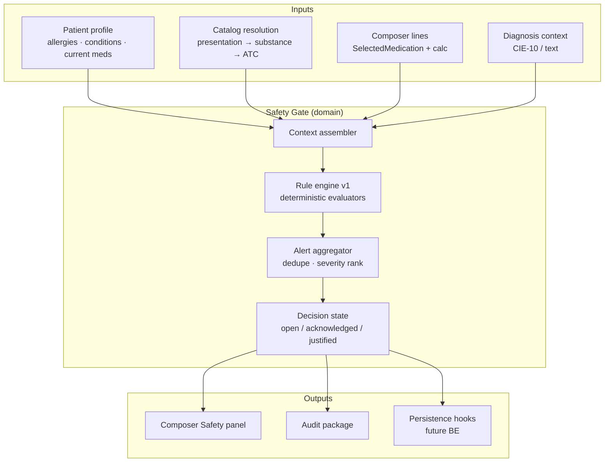
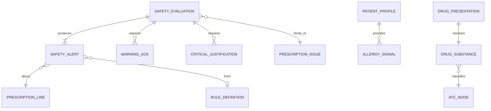
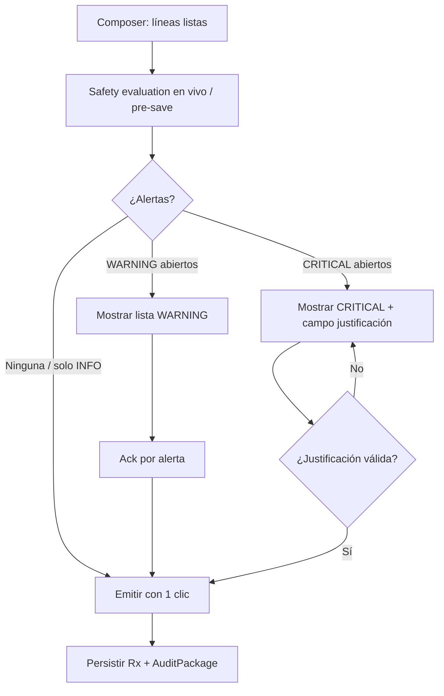
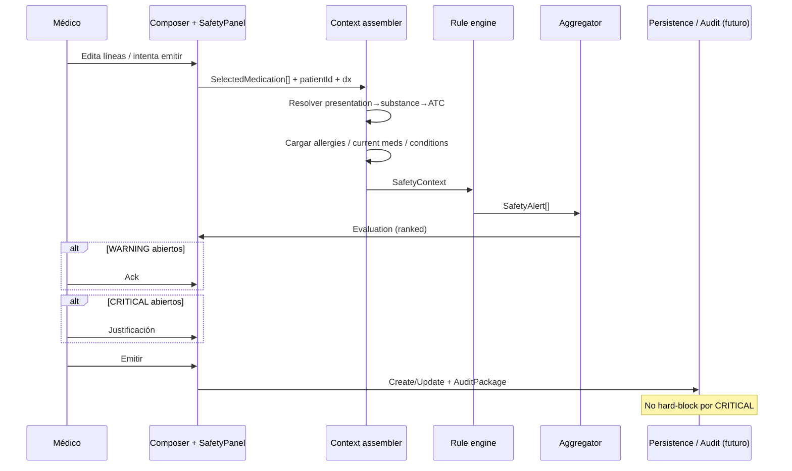

# Prescription Engine Enterprise — PR-4 Phase A  
## Clinical Safety Gate — Domain Design

**ID:** `PRESCRIPTION-ENGINE-ENTERPRISE-PR4-PHASE-A`  
**Tipo:** Diseño de dominio de seguridad clínica (**sin implementación**)  
**Fecha:** 2026-07-22  
**Baseline FE:** `40b3b9657f564544b9c7b298a80634e86b572e4b`  
**Baseline BE:** `e5364190ebeac61f94181c4a9bfb692962e4401c`  
**Precedente:** Phase 0 §4 Safety Model (política CRITICAL aprobada) · PR-1 Catalog · PR-2 Composer · PR-3 Calculation Engine  
**STATUS:** APPROVED by Product Owner  

**Reglas de este documento**
- Diseña el dominio de seguridad; **no** implementa CDSS, IA, FHIR ni código productivo en Phase A.
- La política CRITICAL de Phase 0 es vinculante: **nunca hard-block automático**.

---

## Implementation status — PR-4.1 Clinical Safety Panel + UX States

**PR-4.1**  
**STATUS:** COMPLETED  

| Campo | Valor |
|-------|--------|
| Fecha | 2026-07-22 |
| SHA código (squash → `main`) | `0c237680af31cec92af9fea298ef6cb71e8b8332` |
| SHA Vercel Production | `0c237680af31cec92af9fea298ef6cb71e8b8332` (`0c23768`) |
| Deploy Production | `dpl_4rc3zi4Beyw5mc3tft4MnQrHQqLp` · Ready · alias `https://app.heydoctor.health` |
| Backend (sin cambios / sin redeploy) | `e5364190ebeac61f94181c4a9bfb692962e4401c` |

### Resumen técnico
- Safety Panel inline integrado al Prescription Composer (sin modales invasivos).
- UX de alertas INFO / WARNING / CRITICAL con Decision State, acknowledgement y justification.
- **Sin** Rule Engine clínico, **sin** Backend, **sin** persistencia / audit real.
- Emisión **nunca** se bloquea por seguridad (política Phase A).

### Arquitectura desacoplada (`SafetyProvider`)
```
SafetyProvider (HttpSafetyProvider productivo; Mock solo en dev con flag)
  → PrescriptionSafetyPanel
    → aggregateAlerts + ClinicalDecisionState
      → SafetyAlertCard
```
El Composer solo monta el panel; no contiene lógica de seguridad.  
Producción usa `HttpSafetyProvider` → Rule Engine BE.

### Extensiones al modelo de dominio (PR-4.1)
- **Priority** (independiente de severidad): `HIGH` | `NORMAL` | `LOW` — solo orden de presentación.
- **Confidence** (solo representación): `HIGH` | `PARTIAL` | `LOW` — sin cálculo.
- Contratos: `SafetyEvaluation`, `SafetyAlert`, `SafetyRuleResult`, `DecisionState`, `WarningAcknowledgement`, `CriticalJustification`.

### Selector mock
Escenarios de simulación (`none` / `info` / `warning` / `critical` / `multi` / confidence_*) visibles solo con `MockSafetyProvider` — no son reglas clínicas.

---

## Implementation status — PR-4.2 Clinical Safety Rule Engine v1

**PR-4.2**  
**STATUS:** COMPLETED  

| Campo | Valor |
|-------|--------|
| Fecha | 2026-07-22 |
| SHA código (squash → `main`) | `0deb3cd3b7613977ba02d57b0b3adb18c48a0803` |
| SHA producción Railway | `0deb3cd3b7613977ba02d57b0b3adb18c48a0803` (`0deb3cd3b761`) |
| Deploy Production | `4f27fd60-50f7-48e8-9e24-87c13efe18f0` · ready · `https://pro-api.heydoctor.health` |
| Frontend | Sin cambios de producto / sin redeploy (`d4c5b5aa8795480903b6f05d67eae76c28581a4a`) |

### Resumen técnico
- Rule Engine clínico determinista Release 1 (R1–R7), sin IA/LLM.
- `DrugSafetyCheckService` real: ensambla contexto → registry → evaluators → aggregator → `SafetyEvaluation`.
- `POST /prescriptions/safety-evaluate` expone el contrato para el `SafetyProvider` del FE.
- `blocked` clínico siempre `false` (política CRITICAL: nunca hard-block).
- `AuditPackage` generado con `persistenceStatus: prepared_not_persisted` (persistencia = PR-4.3).

### Rule Registry
Cada regla es una clase independiente (`SafetyRule.evaluate(context) → SafetyRuleResult[]`).  
Agregar reglas no requiere modificar el motor principal.

| Regla | Severidad | Acción clínica |
|-------|-----------|----------------|
| R1 Alergia conocida | CRITICAL | Justificación |
| R2 Alergia sospechada / incompleta | WARNING | Acknowledgement |
| R3 Duplicidad por sustancia | WARNING | Acknowledgement |
| R4 Duplicidad por ATC | WARNING | Acknowledgement |
| R5 Contexto clínico insuficiente | INFO | — |
| R6 Medicamento sin clasificación suficiente | INFO | — |
| R7 Datos incompletos para evaluación | INFO | — |

### Rule Engine / DrugSafetyCheckService
```
Clinical Context
  → DrugSafetyCheckService
    → SafetyRuleEngineService
      → Rule Registry → R1–R7
        → Alert Aggregator
          → SafetyEvaluation (+ AuditPackage prepared_not_persisted)
```

### AuditPackage
Modelo + puntos de integración listos; **sin** persistencia definitiva (`prepared_not_persisted`).

---

## Implementation status — PR-4.3 Clinical Decision Audit Trail

**PR-4.3**  
**STATUS:** COMPLETED  

| Campo | Valor |
|-------|--------|
| Fecha | 2026-07-22 |
| SHA código (squash → `main`) | `31bd1a5ae4f4aa2b2181cb3f05e2fbe4293d1d13` |
| SHA producción Railway | `31bd1a5ae4f4aa2b2181cb3f05e2fbe4293d1d13` (`31bd1a5ae4f4`) |
| Deploy Production | `85dc62dc-955f-407d-b63a-afcd8fb20cdb` · ready · `https://pro-api.heydoctor.health` |
| Migración | `1753300000000-PrescriptionSafetyAuditTrail` · aplicada |
| Frontend | Sin cambios de producto / sin redeploy (baseline producto `d4c5b5aa…`; tip docs puede diferir) |

### Resumen técnico
- **Audit Trail persistente** append-only en `prescription_safety_audits`.
- Persistencia de `SafetyAuditPackage` + `WarningAcknowledgement` + `CriticalJustification` en create/update de receta.
- `packageHash` (SHA-256) para integridad del snapshot.
- `persistenceStatus: persisted` / `issueDecision` derivado (`issued*` / `issued_incomplete_decisions`).
- Rehidratación: `GET /api/prescriptions/:id/safety-audit`.
- Emisión **nunca** hard-block por seguridad.
- Rule Engine R1–R7 sin cambios de lógica.

### Arquitectura
```
DrugSafetyCheckService → SafetyRuleEngineService → SafetyEvaluation
  → SafetyAuditTrailService → prescription_safety_audits (append-only)
  → GET /prescriptions/:id/safety-audit
```

---

## Implementation status — Clinical Safety Integration Sprint (Post PR-4.3)

**STATUS:** COMPLETED  

| Campo | Valor |
|-------|--------|
| Fecha | 2026-07-23 |
| SHA código (squash → `main`) | `8fdf9c4b4f64647dc3e8f9dd08e335a914768523` |
| SHA Vercel Production | `8fdf9c4b4f64647dc3e8f9dd08e335a914768523` (`8fdf9c4b`) |
| Deploy Production | `dpl_ExbSSF7NUK5YFRqUXheUsJTtbyFM` · Ready · alias `https://app.heydoctor.health` |
| Backend (sin cambios / sin redeploy) | `31bd1a5ae4f4aa2b2181cb3f05e2fbe4293d1d13` |

### Resumen
Circuito FE ↔ BE del Safety Platform **completamente integrado**.  
Sin nuevas reglas clínicas; sin cambios al Rule Engine, Audit Trail ni Calculation Engine.

| Item | Entrega |
|------|---------|
| **S1** | `HttpSafetyProvider` → `POST /api/prescriptions/safety-evaluate` (default productivo) |
| **S2** | `ClinicalDecisionState` → `safetyDecision` en create/update |
| **S3** | Mock restringido a desarrollo (`NEXT_PUBLIC_SAFETY_MOCK=1`); deshabilitado en production |
| **S4** | Nomenclatura: `UxIssueDecision` (FE) ≠ `PersistedIssueDecision` (BE) |
| **S5** | Documentación de integración completa |

### Flujo integrado
```
Composer lines
  → HttpSafetyProvider.evaluate
  → POST /prescriptions/safety-evaluate
  → SafetyEvaluation + ClinicalDecisionState (acks/justs UX)
  → create/update + safetyDecision
  → BE re-evalúa + SafetyAuditTrailService.persist
```

### Nomenclatura
| Concepto | Nombre | Capa |
|----------|--------|------|
| Readiness UX | `UxIssueDecision` (`ready` / `needs_ack` / …) | Frontend |
| Decisión al emitir | `PersistedIssueDecision` (`issued*` / …) | Backend audit |
| Estado clínico FE | `ClinicalDecisionState` | Frontend |
| Payload persistencia | `SafetyDecisionPayload` | FE → BE DTO |

---

## 0. Principios del Safety Gate

1. **Physician remains in control** — el gate informa y exige atención; no sustituye criterio clínico.
2. **Gate de calidad/auditoría, no bloqueo opaco** — CRITICAL exige justificación; no impide emitir por sí solo.
3. **Separación de capas** — Catalog ≠ Composer ≠ Calculation ≠ Safety Gate ≠ Persistence ≠ Audit.
4. **Determinismo clínico v1** — reglas v1 son evaluables con datos estructurados; sin IA.
5. **Fail-visible** — si falta dato para evaluar, emitir INFO/WARNING de datos incompletos; no silencio.
6. **Reproducibilidad** — toda alerta, ack y justificación queda ligada a la emisión/versión.

---

## 1. Arquitectura del Safety Gate



### 1.1 Capas

| Capa | Responsabilidad | No hace |
|------|-----------------|---------|
| **Context assembler** | Normaliza alergias, líneas Rx, ATC/substance, DX | No prescribe |
| **Rule evaluators** | Evalúan familias de reglas v1 | No UI, no PDF |
| **Alert aggregator** | Dedup, ranking, estado abierto | No bloquea HTTP |
| **Decision state** | Ack WARNING / justificación CRITICAL | No inventa reglas |
| **Audit package** | Serializa evidencia para persistencia | No escribe DB en Phase A |

### 1.2 Relación con componentes existentes

| Componente hoy | Rol respecto al Gate |
|----------------|----------------------|
| `DrugSafetyCheckService` (BE stub) | Gancho futuro; hoy `{ warnings: [], blocked: false }` |
| `POST/PATCH /prescriptions` | Emisión; **no** debe hard-block por CRITICAL |
| `GET /prescriptions/smart-suggestions` | Puede **previsualizar** warnings; no es el gate de emisión |
| Copilot `governed-*` safety | HITL de sesión AI — **fuera** del gate de emisión de Rx |
| `SafetyStrip` (FE) | Display de perfil; **no** matching fármaco |
| Composer / Calculation | Entrada clínica; **sin** lógica de safety |

### 1.3 Inconsistencia a resolver en implementación (no Phase A)

Hoy el BE contempla `blocked → 400` si el stub lo devolviera.  
**Diseño aprobado:** CRITICAL **nunca** hard-block. La rama `blocked` debe alinearse a política (retirar hard-block o usarla solo para fallos técnicos/contrato inválido, nunca para CRITICAL clínico).

---

## 2. Modelo de dominio

### 2.1 Entidades conceptuales



| Entidad | Definición |
|---------|------------|
| **SafetyEvaluation** | Resultado de evaluar una receta (draft o pre-emisión) en un instante |
| **SafetyAlert** | Hallazgo tipado con severidad, familia, evidencia, línea(s) afectadas |
| **RuleDefinition** | Regla versionada (id, familia, severidad, inputs, condición) |
| **WarningAck** | Aceptación explícita de un WARNING abierto |
| **CriticalJustification** | Motivo clínico obligatorio para emitir con CRITICAL abierto |
| **AuditPackage** | Paquete inmutable: evaluation + acks + justifications + actor + timestamp |

### 2.2 Clasificación de severidad (vinculante)

| Severidad | Qué la dispara (v1) | Presentación UX | Qué requiere el médico | Qué se audita | ¿Bloquea? |
|-----------|---------------------|-----------------|------------------------|---------------|-----------|
| **CRITICAL** | Alergia sustancia/ATC de alta confianza; mismo fármaco activo duplicado con riesgo alto | Banner persistente + panel; no modal bloqueante opaco | **Justificación** obligatoria (motivo tipificado o texto + tipología) | Usuario, fecha/hora, alertId, ruleId, motivo, prescriptionId/versión | **Nunca** hard-block automático |
| **WARNING** | Duplicidad terapéutica ATC; alergia de confianza media; datos incompletos relevantes; posible interacción futura | Lista accionable junto al Composer | **Ack** visible por alerta (o batch de warnings) | Ack por alertId + usuario + timestamp | No |
| **INFO** | Contexto útil (p. ej. “sin alergias registradas”; “ATC no resuelto — evaluación parcial”) | Chip / texto secundario | Nada | Opcional (evaluación sí; ack no) | No |

### 2.3 Familias de alertas (dominio)

| Familia | Código | Descripción |
|---------|--------|-------------|
| Alergia / hipersensibilidad | `allergy_match` | Match alergia ↔ sustancia / INN / ATC |
| Duplicidad terapéutica | `therapeutic_duplication` | Misma sustancia o mismo ATC en líneas / medicación activa |
| Datos incompletos | `incomplete_safety_context` | Sin alergias tipables, sin presentationId, sin DX cuando la regla lo pide |
| Contraindicación | `contraindication` | Condición vs fármaco (**diferido** salvo stubs activables) |
| Dosis fuera de rango | `dose_out_of_range` | Pediátrico/adulto extremos (**diferido**; requiere evidencia) |
| Interacción F–F | `drug_interaction` | (**diferido**; requiere base científica) |
| Embarazo / lactancia / edad | `special_population` | (**diferido**; tablas schema existen `is_active=false`) |

---

## 3. Modelo UX

### 3.1 Principios UX

- **Inline, no modal innecesario** — panel Safety bajo/al lado del Composer.
- **Cero clics extra** en el camino feliz (sin alertas abiertas).
- **≤1 interacción por WARNING** (ack); CRITICAL exige justificación antes de “Crear/Actualizar receta”.
- **No aumenta fricción del Calculation Engine** — safety reacciona a líneas, no a cada tecla de cálculo salvo debounce de evaluación.
- **Copilot no escribe** en el gate ni auto-ack.

### 3.2 Flujo UX (médico)



### 3.3 Componentes UX (diseño; no implementar)

| Componente | Contenido |
|------------|-----------|
| **SafetyPanel** | Resumen por severidad · lista de alertas · estado ack/justificación |
| **AlertRow** | Severidad · mensaje · línea afectada · evidencia corta · acción |
| **WarningAckControl** | Checkbox/botón “He revisado” ligado a `alertId` |
| **CriticalJustificationForm** | Motivo tipificado + texto libre obligatorio si “otro” |
| **SafetyStrip (existente)** | Sigue mostrando alergias de perfil; el Gate es capa distinta |

### 3.4 Qué nunca hace la UX

- Bloquear navegación del encounter por CRITICAL.
- Auto-descartar alertas.
- Mezclar warnings de Copilot governed con el gate de emisión.
- Pedir ack para INFO.

---

## 4. Pipeline completo de validación clínica



### 4.1 Etapas del pipeline

| # | Etapa | Input | Output |
|---|-------|-------|--------|
| 1 | **Trigger** | Cambio de línea / pre-save / smart-suggestions preview | Evento de evaluación |
| 2 | **Assemble context** | Profile + catalog resolve + lines + dx | `SafetyContext` |
| 3 | **Evaluate rules v1** | Context + RuleDefinition[] | Alertas crudas |
| 4 | **Aggregate** | Alertas crudas | Dedup + rank + estado abierto |
| 5 | **Human decision** | Evaluation + UI actions | Acks / justifications |
| 6 | **Emit gate check** | Decision state | `ready_to_issue` \| `needs_ack` \| `needs_justification` |
| 7 | **Persist + audit** | Rx DTO + AuditPackage | Receta + evidencia |

### 4.2 `SafetyContext` (contrato conceptual)

```
SafetyContext {
  patientId
  consultationId?
  cie10CodeId?
  diagnosisText?
  allergies: AllergySignal[]          // normalizadas desde profile JSONB
  chronicConditions: ConditionSignal[]
  currentMedications: MedSignal[]     // desde profile si existe
  lines: Array<{
    lineIndex
    drugPresentationId?
    displayLabel
    substanceId?
    innName?
    atcCode?
    dosage, frequency, duration
    calculation?: { status, totalQuantity, ... }  // opcional; no safety math
  }>
}
```

### 4.3 Momentos de evaluación

| Momento | Obligatorio v1 | Nota |
|---------|----------------|------|
| Pre-emisión (create/update) | **Sí** | Gate real |
| Tras selección de presentación | Recomendado | Early warning |
| Smart-suggestions preview | Opcional | Warnings en ranking; no sustituye gate |
| Renovación (PR-6) | Futuro | Re-evaluación completa |

---

## 5. Matriz de reglas

### 5.1 Release 1 (primer Safety Gate operable)

| ID | Familia | Severidad | Disparador | Inputs | Confianza | Depende de |
|----|---------|-----------|------------|--------|-----------|------------|
| R1 | `allergy_match` | CRITICAL | INN/substanceId de línea = alergia tipada / label normalizado de alta confianza | allergies + presentation→substance | Alta si tipado; media si solo label | Profile + Catalog |
| R2 | `allergy_match` | WARNING | Match parcial (sinónimo / ATC clase) sin certeza de sustancia | allergies + ATC | Media | Profile + Catalog |
| R3 | `therapeutic_duplication` | WARNING | Dos líneas con mismo `substanceId` o mismo ATC nivel clínico acordado | lines + ATC | Alta | Catalog |
| R4 | `therapeutic_duplication` | CRITICAL | Misma presentación/sustancia ya en medicación activa del perfil **y** nueva línea | lines + current meds | Media–Alta | Profile tipado o heurística controlada de label |
| R5 | `incomplete_safety_context` | INFO | Paciente sin alergias registradas | profile | Alta | Profile |
| R6 | `incomplete_safety_context` | WARNING | Línea sin `drugPresentationId` (texto libre) → evaluación alergia/ATC incompleta | lines | Alta | Composer |
| R7 | `incomplete_safety_context` | INFO | ATC/substance no resoluble desde presentación | catalog lookup | Alta | Catalog |

### 5.2 Diferidas (post v1)

| ID | Familia | Por qué se difiere | Requisito |
|----|---------|-------------------|-----------|
| D1 | Interacciones F–F | Requiere base científica curada / licencia | Evidencia + ownership clínico |
| D2 | Contraindicaciones por condición | Tablas schema dormidas (`is_active=false`) | Activar data + mapping condiciones→CIE/SNOMED |
| D3 | Embarazo / lactancia / edad | Idem tablas + dato demográfico confiable | BE data + profile fields |
| D4 | Dosis fuera de rango | Requiere rangos por sustancia/edad/peso | Evidencia + Calculation Engine inputs tipados |
| D5 | Pediátrico mg/kg | Fuera de Composer tipado actual | Peso paciente + reglas dosis |
| D6 | Renovación safety | Depende Continuity (PR-6) | Flujo renew |
| D7 | IA / Copilot auto-gate | Prohibido por principios | Nunca en write-path sin HITL |

### 5.3 Modelo de alerta (salida)

```
SafetyAlert {
  alertId                 // estable en la evaluación
  ruleId                  // R1…
  family
  severity                // CRITICAL | WARNING | INFO
  message                 // clínico, breve
  evidence: {
    patientSignals[]
    drugSignals[]         // substanceId, atcCode, presentationId
    matchType             // exact_substance | atc_class | label_normalized | …
    confidence            // high | medium | low
  }
  lineIndexes[]
  source                  // rule_engine_v1
  requires: "none" | "ack" | "justification"
}
```

### 5.4 Modelo de override

| Severidad | Override permitido | Forma | Persistencia mínima |
|-----------|-------------------|-------|---------------------|
| INFO | N/A | — | Evaluation snapshot |
| WARNING | Sí | Ack explícito (`alertId`, userId, ts) | AuditPackage |
| CRITICAL | Sí (único path de emisión con CRITICAL abierto) | Justificación: `reasonCode` + `reasonText` + userId + ts | AuditPackage ligado a Rx |

**Overrides prohibidos:** ack implícito por timeout; ack al cerrar panel; justificación vacía; auto-justificación por IA.

---

## 6. Modelo de auditoría

### 6.1 AuditPackage (concepto)

```
AuditPackage {
  evaluationId
  evaluatedAt
  actorUserId
  patientId
  consultationId?
  prescriptionId?          // post-persist
  alerts[]                 // snapshot inmutable
  warningAcks[]
  criticalJustifications[]
  issueDecision            // issued_with_no_open_critical | issued_with_justified_critical | …
  engineVersion            // "safety-gate-v1"
}
```

### 6.2 Qué se audita siempre

- Evaluación completa en emisión (aunque no haya alertas).
- Cada WARNING ack.
- Cada CRITICAL justification.
- Identidad del actor y timestamp.
- Identidad de líneas/presentationIds involucrados.

### 6.3 Qué no se audita como “override”

- Clicks de navegación.
- Cálculos de cantidad (PR-3) salvo que una regla futura los cite.
- Sugerencias Copilot no aceptadas.

### 6.4 Relación con BE actual

| Hoy | Gap |
|-----|-----|
| `PRESCRIPTION_CREATED` audit + outbox | No incluye safety acks/justifications |
| Stub `DrugSafetyCheckService` | No produce alertas reales |
| Entidad Prescription sin campos safety | Requiere extensión BE en PR de implementación (no Phase A) |

---

## 7. Dependencias (reutilización auditada — sin integración)

### 7.1 Reutilizable ahora (lectura)

| Recurso | Capacidad real | Uso en Gate |
|---------|----------------|-------------|
| `GET/PUT /patients/:id/profile` | Alergias/condiciones JSONB libres | Señales de entrada (normalizar) |
| `GET /clinical-catalog/drug-presentations/:id` | substance + forma + vía | Resolver identidad fármaco |
| `GET /clinical-catalog/drug-substances?atcCode=` | ATC / INN | Duplicidad / clase |
| `GET /clinical-catalog/drug-therapeutic-groups` | Jerarquía ATC | Match de clase |
| `GET /prescriptions/smart-suggestions` | Slot `warnings[]` | Preview opcional |
| FE `SelectedMedication` + catalog types | Identidad presentation-first | Input de líneas |
| FE `SafetyStrip` | Display alergias | No es el Gate |

### 7.2 Existe pero no es el Gate

| Recurso | Por qué no |
|---------|------------|
| Copilot governed allergy/contraindication | Asesoría HITL de sesión; no emisión Rx |
| `clinical-safety.layer.ts` (copilot) | Gate de prompts AI |
| Tablas contraindicación/embarazo/lactancia/edad | Schema dormido (`is_active=false`) |

### 7.3 Dependencias por capa

| Capacidad | FE | BE | Catálogo | Evidencia científica |
|-----------|----|----|----------|----------------------|
| R1–R3 allergy/duplication básica | UI gate + context | Evaluador o contrato warnings | Presentations/ATC | Baja (matching identidad) |
| Persistencia ack/justificación | Cliente DTO | **Sí — nuevo** | No | No |
| Contraindicaciones runtime | UI | Activar tablas + API | Data curada | **Sí** |
| Interacciones F–F | UI | Motor + dataset | Mapping RxNorm/ATC | **Sí (alta)** |
| Dosis fuera de rango | UI | Reglas | Rangos por sustancia | **Sí** |

### 7.4 Qué depende de Backend vs Catálogo vs Evidencia

| Pregunta | Respuesta de diseño |
|----------|---------------------|
| ¿Qué puede empezar en FE-only? | Panel UX + evaluación cliente **solo** si BE aún no expone motor; **no recomendado** como verdad de emisión. Emisión debe validar en BE. |
| ¿Qué requiere Backend en el primer release implementable? | Evaluador real (reemplazo stub), contrato de warnings en create/update, persistencia AuditPackage, alinear `blocked` con política CRITICAL |
| ¿Qué requiere Catálogo? | `drugPresentationId` en líneas; substanceId/ATC resolubles |
| ¿Qué requiere evidencia científica? | Interacciones, rangos de dosis, embarazo/lactancia, contraindicaciones clínicas formales |

---

## 8. Roadmap por PR (post Phase A)

| Orden | PR | Entrega | Notas |
|-------|-----|---------|-------|
| **A** | **PR-4 Phase A** | Este diseño | Sin código |
| **B** | **PR-4.1 Safety Gate FE shell** | SafetyPanel + estados UX + consumo de evaluation (mock o API) | Sin CDSS completo; no hard-block |
| **C** | **PR-4.2 Safety Engine BE v1** | Reemplazar stub: R1–R7; devolver warnings tipados; **prohibir hard-block CRITICAL** | Depende catálogo + profile |
| **D** | **PR-4.3 Audit + override persistence** | Ack WARNING + justificación CRITICAL persistidos y auditados | Extensión DTO/entidad |
| E | PR-5 Integrity | Versionado / GET `:id` / audit update-cancel | Complementa AuditPackage |
| F | PR-6 Continuity | Renew re-run Safety Gate | Reutilizar evaluation |
| — | Diferidos D1–D7 | Interacciones, pregnancy, dose-range, IA | Solo con evidencia + data |

**No iniciar implementación** hasta aprobación explícita del PO de este Phase A.

---

## 9. Riesgos

| Riesgo | Impacto | Mitigación de diseño |
|--------|---------|----------------------|
| Alergias JSONB no tipadas → falsos negativos/positivos | Alto clínico | R5/R6 INFO/WARNING de contexto incompleto; CRITICAL solo con match de alta confianza |
| Hard-block BE inconsistente con política PO | Alto producto | Alinear stub/servicio: CRITICAL nunca `blocked` |
| Usar Copilot governed como gate de Rx | Confusión + bypass audit | Separación explícita de bounded contexts |
| Sobrecargar v1 con interacciones F–F | Retraso + falsa seguridad | Diferir D1 hasta dataset curado |
| Evaluación solo FE | Bypass / no reproducible | Emisión valida en BE (PR-4.2) |
| Alert fatigue | Médico ignora | Severidad estricta; INFO no pide ack; dedupe |
| Texto libre sin `drugPresentationId` | Safety ciego | WARNING R6; incentivar catálogo (PR-1) |

---

## 10. Fuera de alcance (reafirmado)

- Implementación de código FE/BE  
- CDSS completo / IA / FHIR  
- Modificar Composer o Calculation Engine en Phase A  
- Activar tablas de contraindicación dormidas  
- Merge / deploy  

---

## 11. Criterios de aceptación de este diseño (PO)

1. Arquitectura y separación de capas aprobadas.  
2. Severidades CRITICAL / WARNING / INFO y política de no hard-block confirmadas.  
3. Matriz R1–R7 como release 1 aceptada.  
4. Diferidos D1–D7 aceptados.  
5. Roadmap PR-4.1 → 4.3 aceptado antes de autorizar código.

---

**Fin Phase A — Safety Design.**  
Sin implementación. Esperar aprobación explícita del Product Owner.
