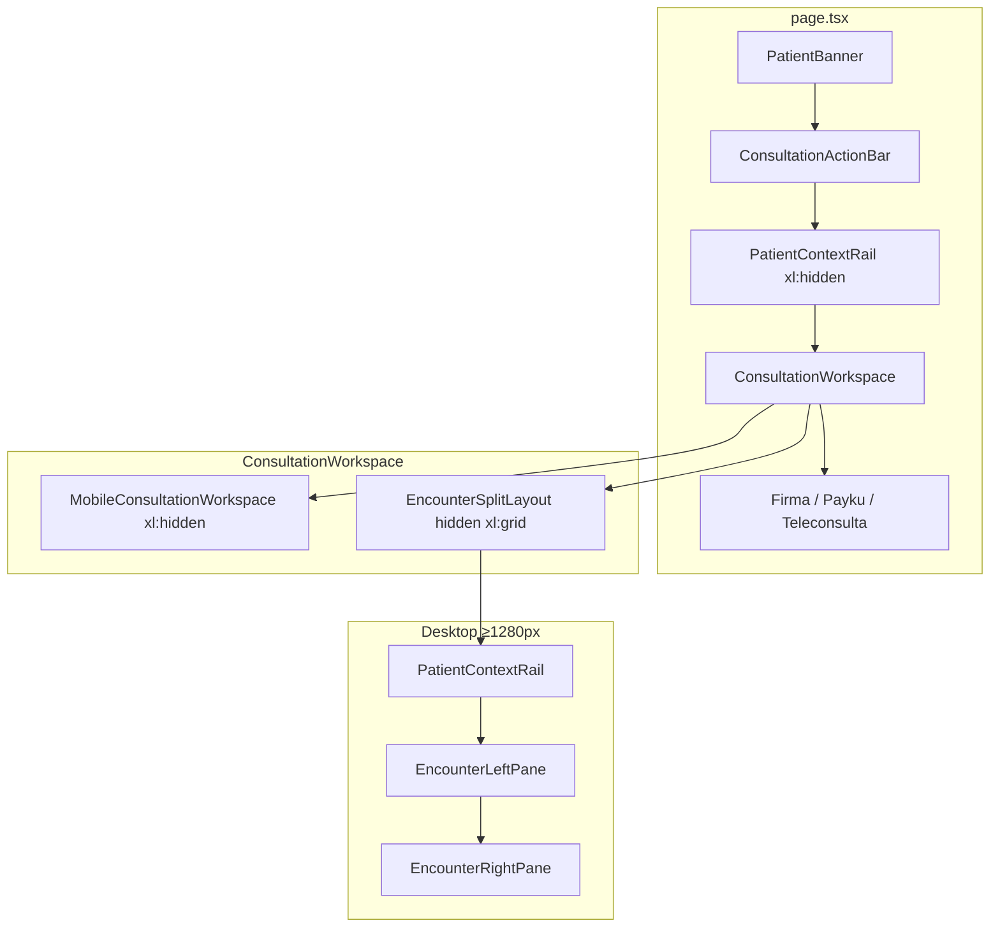

# PR #50 — Enterprise Encounter Layout with Patient Context Rail

| Campo | Valor |
|-------|--------|
| Repo | [jairosc23/heydoctor-frontend](https://github.com/jairosc23/heydoctor-frontend) |
| Rama | `feat/consultas-encounter-split-layout` |
| Commit HEAD (documentación) | `d791ea03` (Fase 5); doc en commit posterior |
| PR | #50 — `feat(consultas): enterprise encounter layout with patient context rail` |
| Baseline P0 | `6d105137` — Clinical Workspace P0 (#49) |
| Backend ref | `SAVAC-HeyDoctor/heydoctor-backend-pro` @ `1f5a785` (**sin cambios**) |
| Ruta | `/panel/consultas/[id]` |

## 1. Objetivo del PR

Mejorar la experiencia de **encounter enterprise** en escritorio (≥1280px) sin alterar flujos críticos del P0:

- Mostrar **contexto del paciente** persistente (edad, sexo, documento, alergias, alertas, enlace a ficha).
- Presentar **documentación clínica** (SOAP, Ficha, IA) y **gestión** (Órdenes, Documentos) en **dos columnas simultáneas**.
- Mantener en móvil/tablet (&lt;1280px) el **workspace por tabs idéntico al P0**.

**Fuera de alcance:** WebRTC, Payku, firma, autosave, serialización `[[HD_CR_V1]]`, APIs nuevas, cambios de backend.

---

## 2. Arquitectura final



### Commits por fase

| Fase | SHA | Entrega |
|------|-----|---------|
| 1 | `a52a8259` | `lib/patient-profile-display.ts` + tests |
| 2 | `6efb8efb` | `PatientContextRail` + fetch en `page.tsx` |
| 3 | `abb6ae37` | `MobileConsultationWorkspace` (extracción P0) |
| 4 | `b5d1f84c` | Shell desktop (placeholders) |
| 5 | `d791ea03` | Paneles reales + estado desktop |
| 6 | *(este doc)* | `PR-50-IMPLEMENTATION.md` |

---

## 3. Componentes nuevos

| Archivo | Responsabilidad |
|---------|-----------------|
| `lib/patient-profile-display.ts` | Formato edad, sexo, documento; `jsonLinesToText` / `collectProfileAlerts` |
| `lib/patient-profile-display.test.ts` | Tests unitarios helpers |
| `PatientContextRail.tsx` | UI lectura: demografía, alergias, alertas, link ficha |
| `MobileConsultationWorkspace.tsx` | Workspace P0 (5 tabs) para &lt;1280px |
| `EncounterSplitLayout.tsx` | Grid `xl:grid-cols-[auto_minmax(0,3fr)_minmax(0,2fr)]` |
| `EncounterLeftPane.tsx` | Desktop: SOAP, Ficha, Asistencia |
| `EncounterRightPane.tsx` | Desktop: Órdenes, Documentos |

---

## 4. Componentes modificados

| Archivo | Cambio |
|---------|--------|
| `ConsultationWorkspace.tsx` | Orquesta móvil + split desktop; tipos `leftPaneTab` / `rightPaneTab` |
| `app/panel/consultas/[id]/page.tsx` | Estado desktop, fetch paciente, handlers ActionBar, layout ancho `xl` |
| `app/panel/pacientes/[id]/page.tsx` | Import `jsonLinesToText` compartido (Fase 1) |

**Sin cambios funcionales en:** `useConsultationAutosave.ts`, `clinical-record.ts`, `SignatureCanvas`, `payments.ts`, rutas `teleconsulta/*`, servicios API.

---

## 5. Flujo móvil (&lt;1280px)

1. `PatientBanner` + `ConsultationActionBar` (full width).
2. `PatientContextRail` visible (`page.tsx`, sin `xl:hidden` en el rail de página — envuelto en `div.xl:hidden`).
3. `MobileConsultationWorkspace`: tabs **SOAP | Ficha | Órdenes | Documentos | Asistencia** (un panel activo).
4. Bloques inferiores P0: consentimiento, teleconsulta, firma, Payku.

Estado: `workspaceTab`, `ordersSubTab` (igual que P0).

---

## 6. Flujo desktop (≥1280px, Tailwind `xl`)

1. Mismo header operativo (banner, action bar, mensajes).
2. **Sin** rail duplicado bajo el action bar (rail solo en grid).
3. `EncounterSplitLayout` visible:

| Columna | Contenido | Tabs |
|---------|-----------|------|
| Rail (`w-56`) | `PatientContextRail` | — |
| Izquierda (3fr) | `EncounterLeftPane` | SOAP, Ficha, Asistencia |
| Derecha (2fr) | `EncounterRightPane` | Órdenes, Documentos |

Estado: `leftPaneTab`, `rightPaneTab`, `ordersSubTab`.

### Handlers ActionBar (desktop + móvil)

| Handler | Móvil | Desktop |
|---------|-------|---------|
| `handleOpenPrescription` | `workspaceTab=orders`, `ordersSubTab=prescriptions` | `rightPaneTab=orders` + mismo sub-tab |
| `handleOpenDocuments` | `workspaceTab=documents` | `rightPaneTab=documents` |
| `handleToggleEdit` / `handleAnalyzeWithAi` | `workspaceTab=record` | `leftPaneTab=record` |

---

## 7. Patient Context Rail

### Datos

- `GET /patients/:id` → demografía (`fetchPatientById`).
- `GET /patients/:id/profile` → alergias, `alerts`, `clinicalWarnings` (`fetchPatientProfile`, fallo no bloqueante).

### Estados UI

| Estado | Comportamiento |
|--------|----------------|
| Sin `patientId` | No renderiza |
| Loading | Skeleton |
| Error | Banner ámbar; consulta usable |
| Vacío | «Sin alergias registradas» / «Sin alertas clínicas» |

### Ubicación responsive

- **Móvil:** entre ActionBar y workspace (`page.tsx`, `xl:hidden`).
- **Desktop:** columna rail del split (`ConsultationWorkspace` → `patientContext` props).

---

## 8. Split Layout

```text
┌──────────┬──────────────────────────┬─────────────────────┐
│ Rail     │ Izquierda (3fr)          │ Derecha (2fr)       │
│ sticky   │ SOAP | Ficha | Asistencia│ Órdenes | Documentos│
└──────────┴──────────────────────────┴─────────────────────┘
```

- Breakpoint: **1280px** (`xl:`).
- Contenedor página: `max-w-5xl` → `xl:max-w-none` + `2xl:max-w-[1600px]`.
- Área útil ~1024px a 1280 viewport (sidebar panel `w-64`): columnas estrechas pero usables; validar también en **1440px+**.

---

## 9. Riesgos conocidos

| ID | Riesgo | Severidad | Mitigación / notas |
|----|--------|-----------|-------------------|
| R1 | Ancho útil reducido a 1280px por sidebar fija | Media | Proporción 3fr/2fr; QA en 1440px |
| R2 | Triple fetch (consulta + paciente + perfil) | Baja | Perfil con `.catch(() => null)` |
| R3 | Dos instancias de paneles en DOM (móvil + desktop ocultos) | Baja | Solo una visible por breakpoint CSS |
| R4 | Carrera autosave vs guardar ficha (P0) | Media | Sin cambio en Fase 5; cola autosave existente |
| R5 | Sin E2E automatizado de detalle consulta | Media | Checklist manual post-merge |
| R6 | `assist` incluye Chat en columna izquierda | Baja | Comportamiento alineado al tab P0 Asistencia |

---

## 10. QA ejecutado

### Automatizado (rama `feat/consultas-encounter-split-layout` @ Fase 5)

```bash
npm run typecheck   # OK
npm run test        # 55/55 OK
npm run build       # OK (Next.js 16.2.6)
```

Cobertura unitaria nueva: `lib/patient-profile-display.test.ts` (17 assertions en 7 suites relacionadas).

### Manual recomendado (staging / pre-merge)

| # | Caso | &lt;1280 | ≥1280 |
|---|------|--------|-------|
| 1 | Rail con paciente completo | ☐ | ☐ |
| 2 | Ver ficha → `/panel/pacientes/[id]` | ☐ | ☐ |
| 3 | Sin perfil: demografía OK, listas vacías | ☐ | ☐ |
| 4 | Sin `patientId`: sin rail | ☐ | ☐ |
| 5 | SOAP autosave + recarga | ☐ | ☐ |
| 6 | Guardar ficha HD_CR_V1 | ☐ | ☐ |
| 7 | Órdenes CRUD + PDF ítems | ☐ | ☐ |
| 8 | Documentos / PDF consulta | ☐ | ☐ |
| 9 | Action bar Receta → órdenes/prescriptions | ☐ | ☐ |
| 10 | Action bar Documentos → columna der. | ☐ | ☐ |
| 11 | Firma + Payku sin regresión | ☐ | ☐ |
| 12 | Teleconsulta fullscreen | ☐ | ☐ |
| 13 | 403 consulta (PR-1.5) | ☐ | — |

---

## 11. Checklist post-merge

- [ ] Merge PR #50 a `main` sin squash destructivo de commits de fase (opcional: squash con mensaje conventional).
- [ ] Vercel preview/producción: verificar `/panel/consultas/[id]` en 375px y 1440px.
- [ ] Confirmar backend sigue en `1f5a785` (sin despliegue frontend-dependent de API nueva).
- [ ] Añadir capturas P1 en `docs/clinical-workspace-p1/reference-screenshots/` (ver §12).
- [ ] Comunicar a médicos: layout desktop nuevo; móvil sin cambios.
- [ ] Monitorear errores Sentry en ruta consulta (48h).
- [ ] Cerrar deuda opcional: React Query cache para perfil paciente; E2E Playwright detalle consulta.

---

## 12. Capturas de referencia

### P1 (PR #50)

**No hay capturas commitadas en esta rama** al cierre de Fase 6.

Se recomienda añadir tras validación en staging:

| Archivo sugerido | Viewport | Contenido |
|------------------|----------|-----------|
| `reference-screenshots/01-encounter-mobile-p50.png` | 375px | Tabs P0 + rail |
| `reference-screenshots/02-encounter-desktop-1280-p50.png` | 1280px | Split 3 columnas |
| `reference-screenshots/03-encounter-desktop-1440-p50.png` | 1440px | Split con más aire |
| `reference-screenshots/04-patient-context-rail-alerts.png` | ≥1280px | Rail con alertas |

Ubicación: `docs/clinical-workspace-p1/reference-screenshots/`

### P0 (referencia histórica)

Capturas pre/post P0 en `docs/clinical-workspace-p0/reference-screenshots/`:

- `01-login-baseline.png`
- `02-panel-consultas-baseline.png`
- `03-login-post-p0.png`

> El detalle de consulta en P0 requería sesión médica; mismo requisito para capturas P1.

---

## Resumen para revisores

PR #50 es **solo frontend**: layout responsive + lectura de perfil paciente existente. El encounter móvil permanece byte-a-byte equivalente al P0 en comportamiento; escritorio gana productividad con contexto lateral y doble columna clínica. No se despliega backend ni se modifican contratos API.
