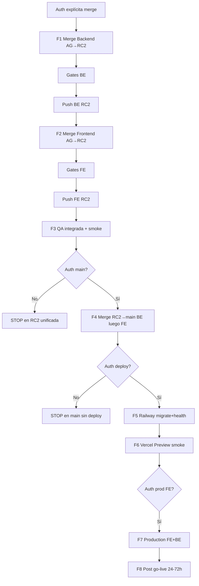

# HeyDoctor Enterprise — Secuencia de release unificada

> Orden **obligatorio**. No saltar fases. No ejecutar sin autorización por fase.

## Secuencia resumida

| # | Acción | Repo | De | A | Deploy |
|---|--------|------|----|----|--------|
| 1 | Merge | Backend | `feature/agenda-enterprise` | `release/medical-copilot-v1.0-rc2` | No |
| 2 | Merge | Frontend | `feature/agenda-enterprise` | `release/medical-copilot-v1.0-rc2` | No |
| 3 | QA | Ambos | tip RC2 unificado | — | No |
| 4 | Merge | Backend luego Frontend | RC2 unificado | `main` | No |
| 5 | Deploy | Backend | `main` / tip autorizado | Railway | Sí |
| 6 | Preview | Frontend | tip autorizado | Vercel Preview | Preview |
| 7 | Promote | Frontend (+BE si falta) | Preview → Production | Vercel/Railway | Sí |
| 8 | Observe | Ambos | Production | — | Monitoreo |

## Gates entre fases

- Tras 1 y 2: format/lint/build/tests (y Playwright si hay `.env.e2e`).  
- Tras 3: checklist smoke PASS.  
- Tras 4: tip `main` contiene ambos productos.  
- Tras 5–7: health + smoke.  
- Tras 8: sin P0 en ventana de observación.

## Documentos por fase

| Fase | Doc |
|------|-----|
| 1–2 | `enterprise-merge-execution-runbook.md` |
| 3 | `enterprise-smoke-test-checklist.md`, `enterprise-post-merge-validation.md` |
| 4–7 | `enterprise-production-promotion-runbook.md` |
| Rollback | `enterprise-rollback-runbook.md` |
| 8 | `enterprise-post-deploy-validation.md` |
| Go-live | `enterprise-production-go-live-checklist.json` |
