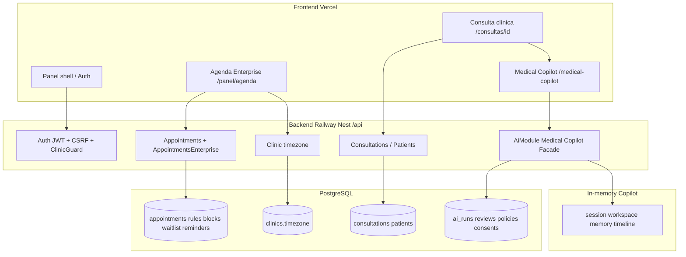

# HeyDoctor — Arquitectura Enterprise Consolidada

## Vista de plataforma

## Principios

1. **Bounded contexts separados** — Agenda ≠ Copilot en código.  
2. **SSOT Backend** para Agenda y EMR; Copilot sesión efímera.  
3. **Auth compartido** — no forks de seguridad por producto.  
4. **Kill switch Copilot** no apaga Agenda ni auth.  
5. **Sin IA en Agenda** (explícito F1–F10).  
6. **Deploys independientes** FE/BE con checklists por producto.

## Inventario de módulos (resumen)

### Frontend

| Producto | Paths |
|----------|-------|
| Agenda | `app/panel/agenda`, `components/agenda`, `lib/agenda`, hooks `use-*-enterprise|blocks|waitlist|reminders|clinic-timezone` |
| Copilot | `app/panel/consultas/[id]/medical-copilot`, `components/medical-copilot`, `lib/medical-copilot`, contexts |
| Shared | `lib/context/AuthContext`, `middleware`, `lib/services/clinic|auth`, panel layout |

### Backend

| Producto | Modules |
|----------|---------|
| Agenda | `appointments`, `appointments-enterprise`, `clinic` (timezone) |
| Copilot | `ai` (facade, session, workspace, memory, timeline), `clinical-copilot` |
| Shared | `auth`, `authorization`, `common/csrf`, `patients`, `consultations` |

## Contratos HTTP (referencia)

- Agenda: `/api/appointments/*`, `/api/clinic/me`, `/api/doctor-profile/me`  
- Copilot: `/api/medical-copilot/*` (+ legacy `/api/ai/*` governance)  
- Detalle Agenda: `docs/agenda-enterprise-inventory.json`

## Compatibilidad

| Escenario | Compatible |
|-----------|------------|
| FE Agenda branch + BE Agenda HEAD `82841419` | ✔ |
| FE/BE Copilot release RC2 | ✔ certificado |
| FE Agenda tip + BE Copilot-only tip sin migraciones Agenda | ✖ riesgo |
| Un solo tag sin reconciliar divergencia Git | ✖ |

## Namespaces / barrels

- FE: servicios en `lib/services/*` (appointments vs medical-copilot separados).  
- BE: módulos Nest por dominio; availability montada en `AppointmentsController` (sin controller enterprise dedicado — intencional).
