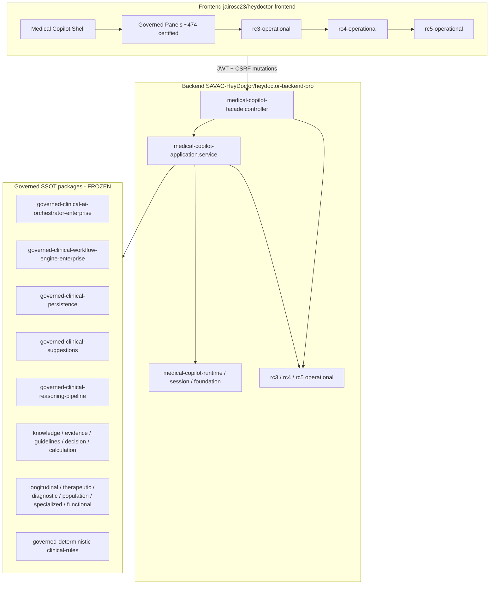

# Medical Copilot RC6 — Architecture Certification

> Auto-generated certification map. Branch: `release/medical-copilot-v1.0-rc2`  
> No runtime behavior changes.

## Bounded contexts

## Module dependency layers

| Layer | Responsibility | Freeze |
|---|---|---|
| Facade HTTP | GET/POST Medical Copilot surface, JWT+RBAC+FeatureGuard | Frozen contracts |
| Application / builders | `*ForSession` package builders | Frozen count (17 certified) |
| Governed packages (18) | Deterministic clinical SSOT | Frozen |
| Orchestrator enterprise | Fan-in of aggregators | Frozen |
| Workflow engine enterprise | Stage workflows | Frozen |
| Persistence | HITL gates + internal TypeORM connectors | Frozen |
| Runtime / session / foundation | Session ownership, kill-switch, TTL | Frozen |
| RC3–RC5 operational | Memo, isolation, resilience, metrics, drift | Certified; no RC6 runtime layer |

## Packages (18)

See `medical-copilot-ssot-catalog-rc3.md` and `medical-copilot-rc6-inventory.json`.

## Workflows / orchestrators

- Workflow endpoints: **21** (certified RC5 diagnostics)
- Orchestrator package + related GETs: certified under `governed-clinical-ai-orchestrator-enterprise`
- FE workflow CB-1 ≠ backend workflow engine ≠ AI-15 workflow-integration (naming collision documented; no renames in RC6)

## Persistence / runtime / frontend

| Surface | Location |
|---|---|
| Persistence | `src/ai/governed-clinical-persistence/` |
| Runtime | `medical-copilot-runtime.service.ts`, session, foundation store |
| Frontend API | `lib/medical-copilot/api.ts`, `medicalCopilotGet` |
| FE operational | `lib/medical-copilot/rc{3,4,5}-operational/` |

## Contract integrity

- Baseline: `src/ai/rc5-operational/rc5-contract-baseline.json`
- Drift detector fails on breaking schema/endpoint/governance/envelope/package shape changes
